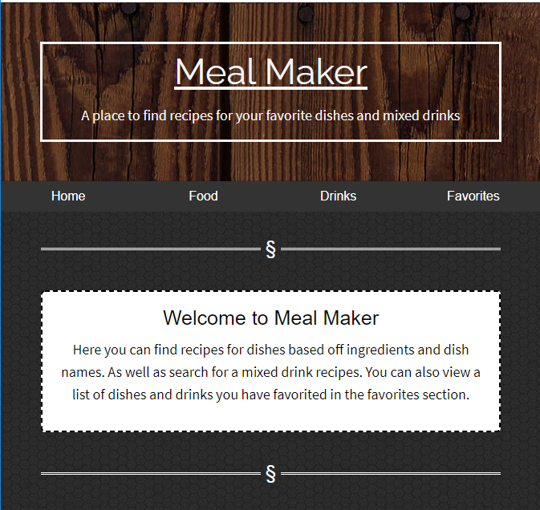
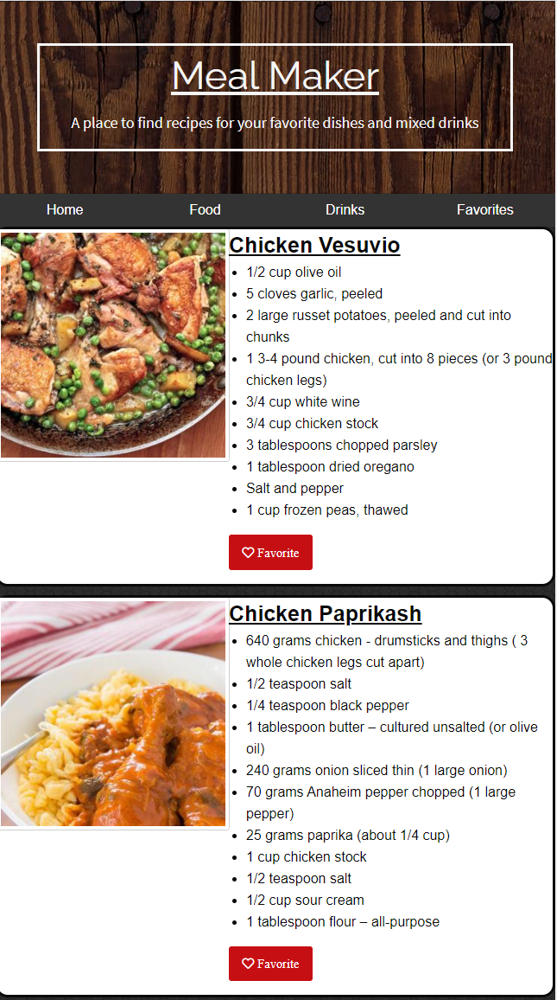
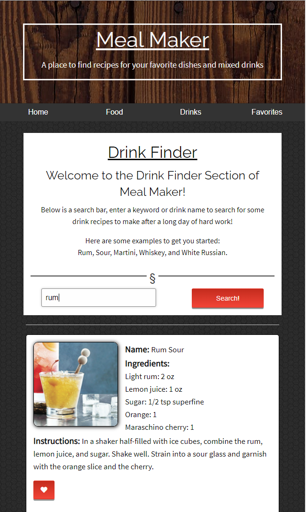
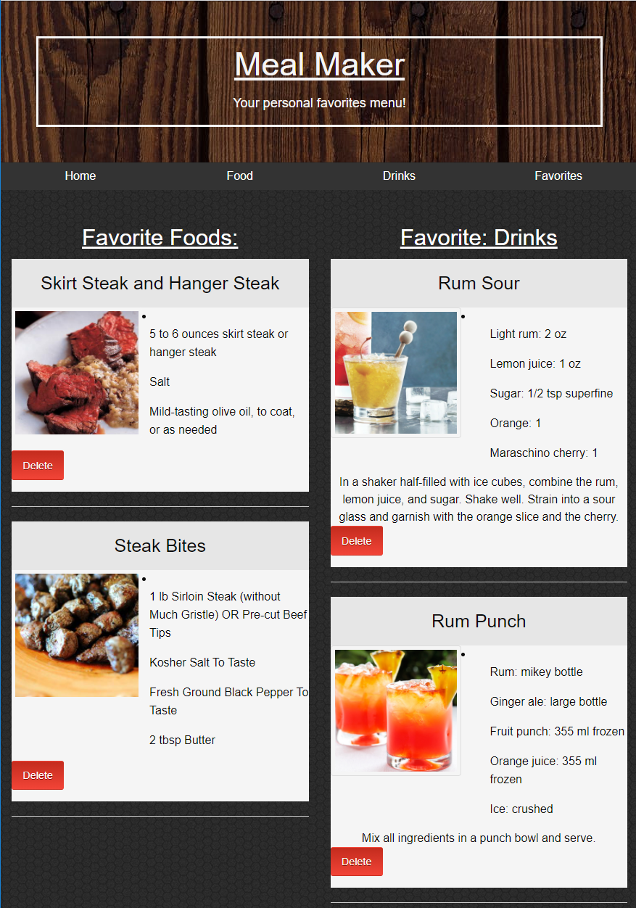

# Meal Maker
```
Live Site: https://jasonmcd96.github.io/Meal-Maker/
```

## Description

Meal Maker is an app for a user to search for meal recipes and drink recipes. Using 3rd party APIs we were able to receive objects for dishes and for drinks that had necessary ingredients and steps to make them. The user is also able to save recipes that they have found to their favorites that are stored locally. When the user navigates to the favorites tab they are presented with lists of their favorited drink and food recipes. In the food tab the user is able to search for a meal recipe by searching with ingredient names and is also able to view the website in which the recipe directions are located by clicking the image. When the user navigates to the drinks tab they are able to search for mixed drink recipes using a keyword or drink name.

The following images demonstrate the application's functionality:

## Home

## Food

## Drinks

## Favorites


